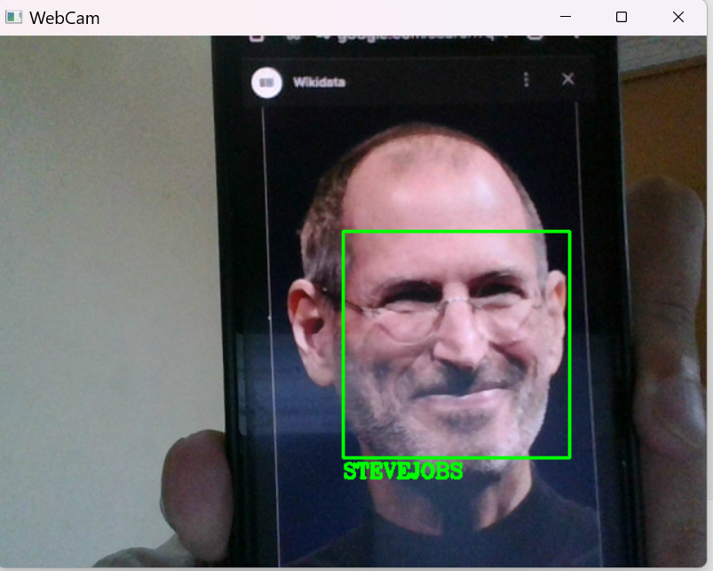

# Face Recognition Attendance System

This project implements a **Face Recognition based Attendance System** using Python, OpenCV, and the `face_recognition` library. It detects faces from a webcam or IP camera, matches them against known images, and logs attendance automatically in a CSV file.

---

## Features

- Detects and recognizes faces in real-time from webcam feed.
- Compares faces with pre-encoded images stored in a directory (`Images` folder).
- Logs attendance with name, time, and date in `Attendence.csv` file.
- Draws bounding boxes and labels recognized faces on the video feed.
- Supports multiple faces recognition simultaneously.

---

## Requirements

- Python 3.7+
- OpenCV (`opencv-python`)
- `face_recognition'
- `numpy`

---

## Installation

1. Clone the repository:
   ```bash
   git clone 

2. pip install -r requirements.txt
3. run python script


## Demonstration of Comparing Faces
1. 🔍 Face Detected

The system detects faces in real-time from the webcam feed and marks them with bounding boxes.


2. 🖥️ Terminal Output

Recognized names and timestamps are displayed in the terminal for live feedback.


3. 📝 Attendance Recorded

Attendance is automatically recorded in the Attendence.csv file.

